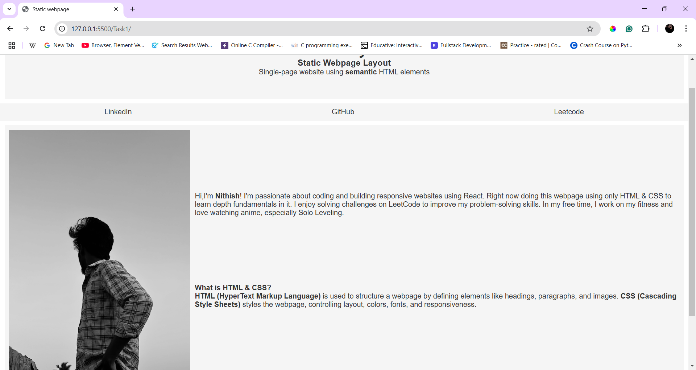
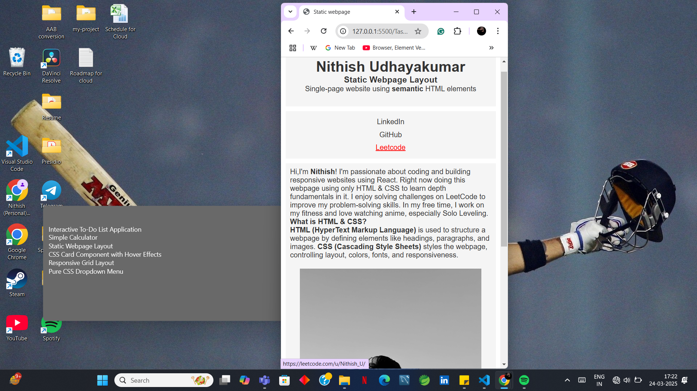

# Static Webpage Layout

## Overview
This project is a simple static webpage using semantic HTML elements and CSS for styling and responsiveness.

## Features
- Uses `<header>`, `<nav>`, `<main>`, and `<footer>` for structured content.
- Basic CSS for typography and color styling.
- Responsive layout using media queries for better mobile adaptation.
- Used `flexbox` concept to arrange elements.

## Learned and Used concepts
- For this task I brushed up with `flexbox` for arranging the content in proper alignment.
- Played the **CSS Froggy game** to get used to `Flexbox`.
- Tbh I didn't used to **media queries** but I have learned about the concepts of **media queries** and used it in this task.

## Output

