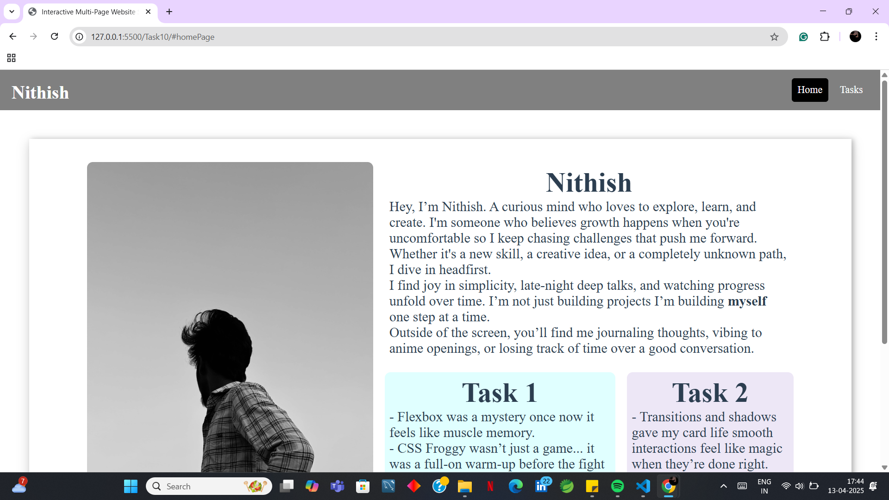
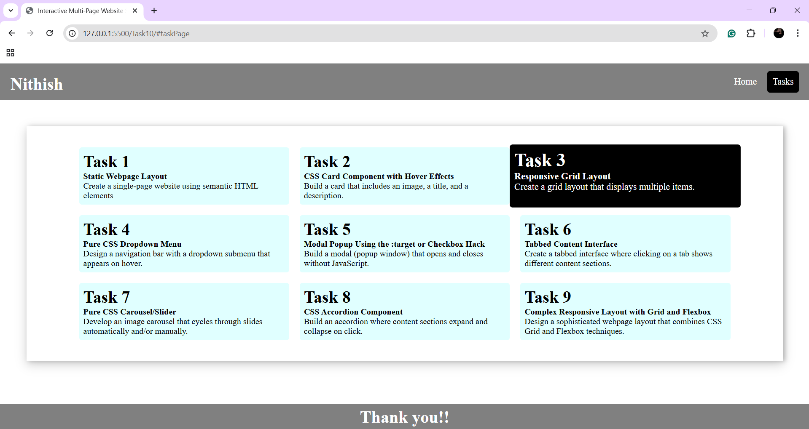
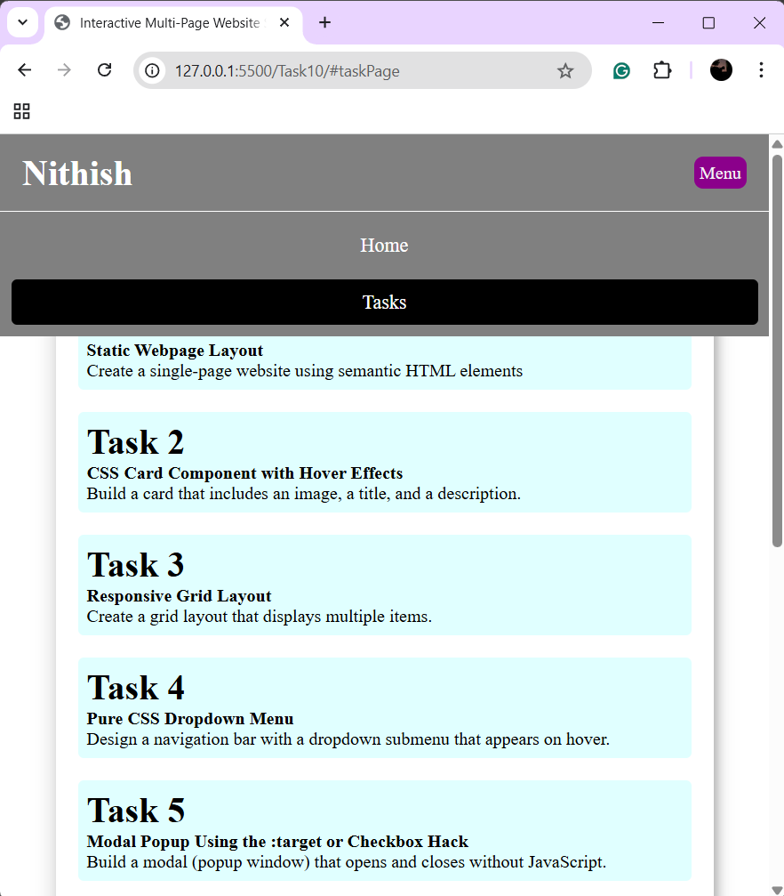

# Interactive Multi-Page Website Simulator with CSS Only

## Objective

Created a fully functional, multi-section website that simulates navigation between pages **using only HTML and CSS** — no JavaScript involved.  
The layout includes animated page transitions, responsive design, and interactive navigation using modern CSS techniques like `:target`, Grid, Flexbox, and pseudo-classes.

## New Things Learned

- Mastered the use of the `:target` pseudo-class to simulate navigation.
- Combined **Grid** and **Flexbox** to design a clean and responsive layout.
- Created a mobile-responsive menu using only HTML + CSS.
- Implemented CSS transitions and transforms for smooth page switching.
- Used advanced pseudo-classes like `:has()` to dynamically highlight the active tab.

## Output

> **Home Section**

> **Task Page**

> **Mobile Navigation**

