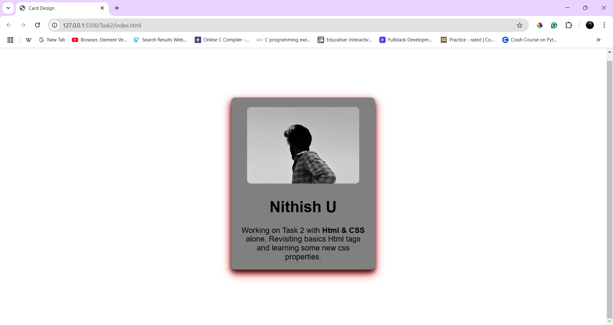

# CSS Card Component with Hover Effects

## Description
A simple card component built using HTML and CSS. The card features an image, a title, and a description, with a smooth hover effect.

## Features
- Styled with borders, shadows, and padding.
- Includes a hover effect that scales and adds a box shadow.
- Uses `Poppins` font for a clean look.
- Fully responsive and centered using Flexbox.

## Learned and Used concepts
- In this task I have learned about `transition`,`box-shadow` and `transform` concepts in depth in *W3schools*.

## Output

