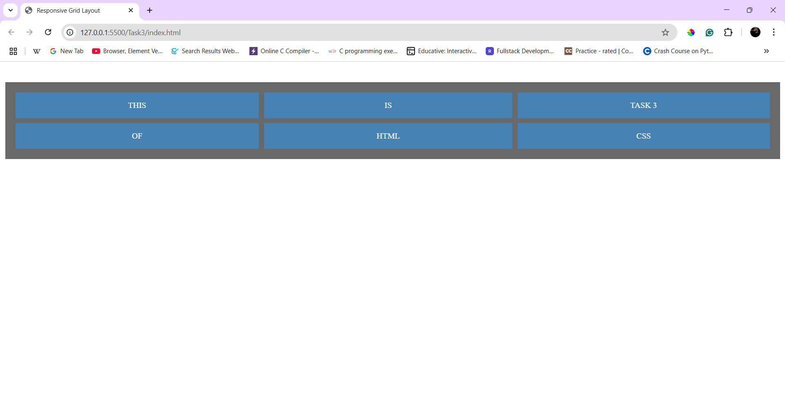
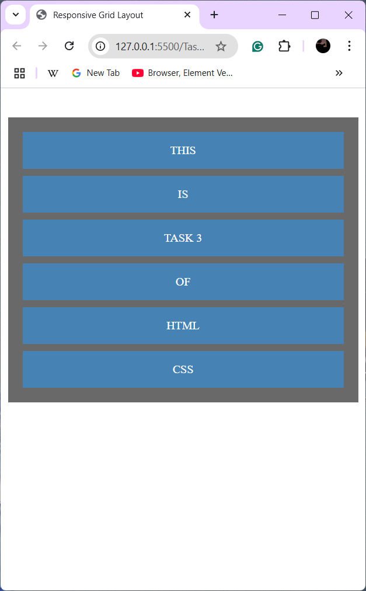

# Responsive Grid Layout

## Description
A simple **responsive grid layout** using **CSS Grid** that adapts to different screen sizes.

## Features
- **Three-column layout** on desktop.
- **Single-column layout** on mobile (using media queries).
- **Smooth hover effect** that scales elements with transitions.

## Learned and Used concepts
- `Grid` which is used for the proper alignment and played the **CSS Garden game** for this concepts it helps me alot to understand it clearly.
- Should learn more in this concept to simplify the work of arrangment between elements.

## Output

