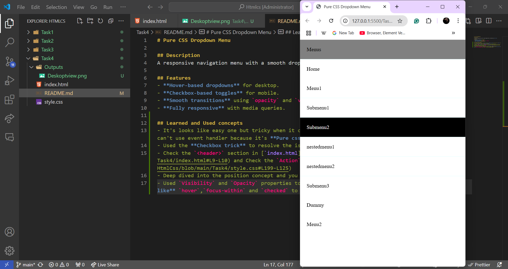

# Pure CSS Dropdown Menu

## Description
A responsive navigation menu with a smooth dropdown effect, created using **pure CSS**.

## Features
- **Hover-based dropdowns** for desktop.
- **Checkbox-based toggles** for mobile.
- **Smooth transitions** using `opacity` and `visibility`.
- **Fully responsive** with media queries.

## Learned and Used concepts
- It's looks like easy one but tricky when it comes to **Mobile screen** where user can't *hover*. We can't use event handler because it's **Pure css dropdown**.
- Used the **Checkbox trick** to resolve the issue. Tbh, I referred youtube video.
- Check the `<header>` section in [`index.html] (https://github.com/Nithishvikky/HtmlCss/blob/main/Task4/index.html#L9-L10) and Check the `Action` in [`style.css`] (https://github.com/Nithishvikky/HtmlCss/blob/main/Task4/style.css#L199-L125)
- Deep dived into the position concept and you can see it in the [`style.css`] file.
- Used `Visibility` and `Opacity` properties to hide the dropdown elememts. Used **CSS pseudo-classes like** `hover`,`focus-within` and `checked` to show the dropdown elements.

## Output

