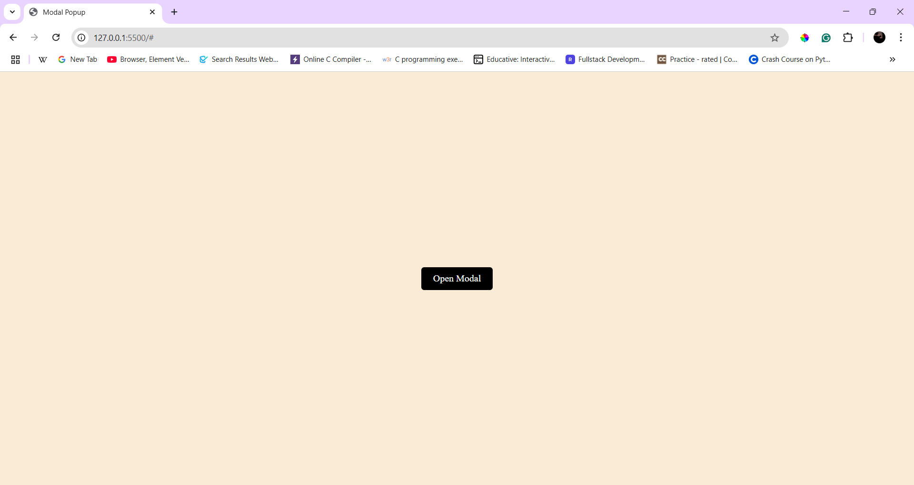
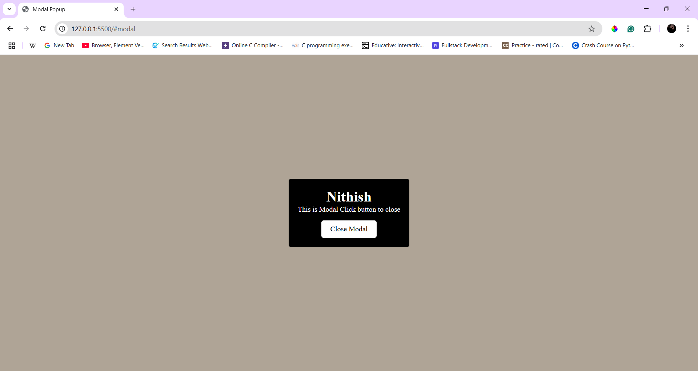

# Modal Popup

## Description
A **modal** (popup window) that opens and closes without JavaScript.

## Learned and Used concepts
- Tried **CSS pseudo-class** `checked` but it's really messy to with that. So learned and used `target` **pseudo-class**.
- Still have a confusions in position concept, should clear it.
- Understood the **flexbox** concept completely and cleared confusions in **display** concept.

## Output

