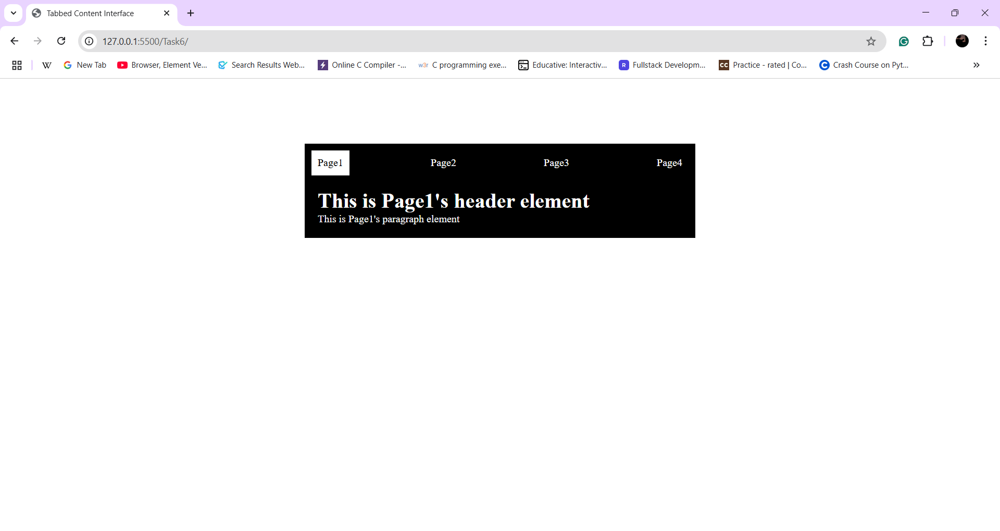
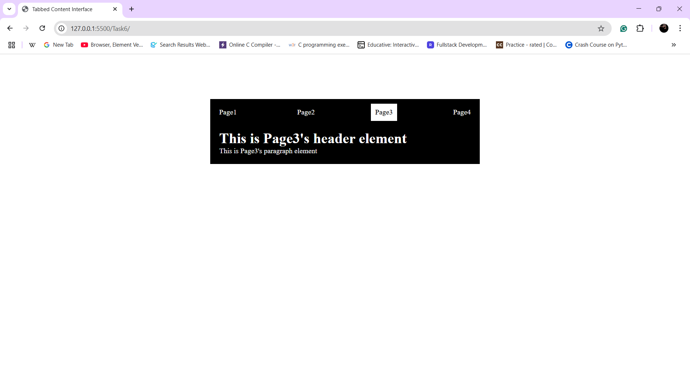

# Tabbed Content Interface

## Description
By **Tabbing** the navbar we can change the content without Javascript

## Learned and Used concepts
- Used **Radio-Buttons** and **CSS pseudo-class** `checked`.
- Getting used to with position concept.

## Output

