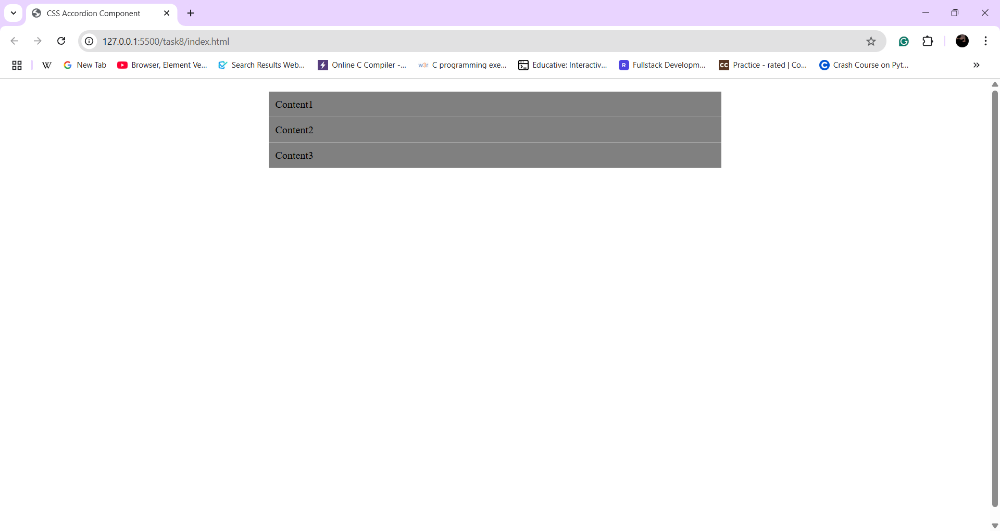
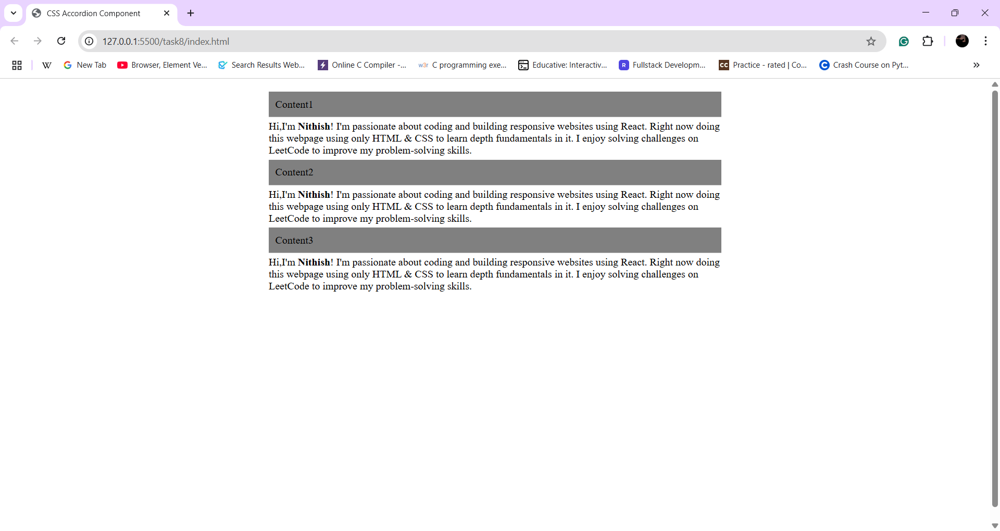

# CSS Accordion Component

## Description
Implemented **Accordion Component** using Checkbox trick

## Learned and Used concepts
- Used **Checkbox** and **CSS pseudo-class** `checked`.
- Used `max-height` property to expand and collapse the content on click.

## Output

