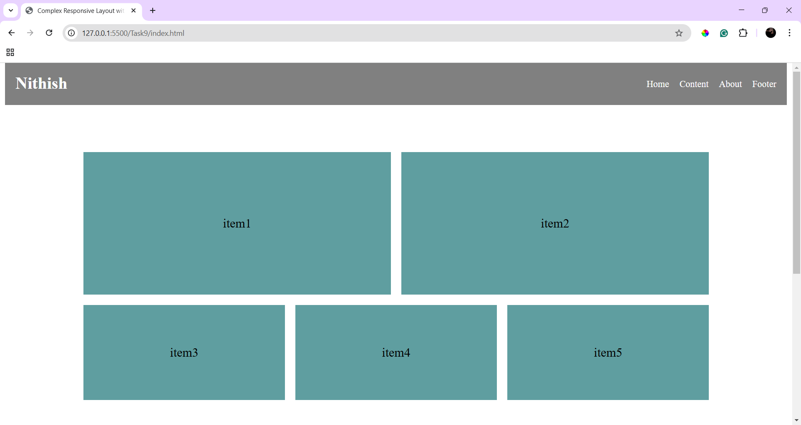
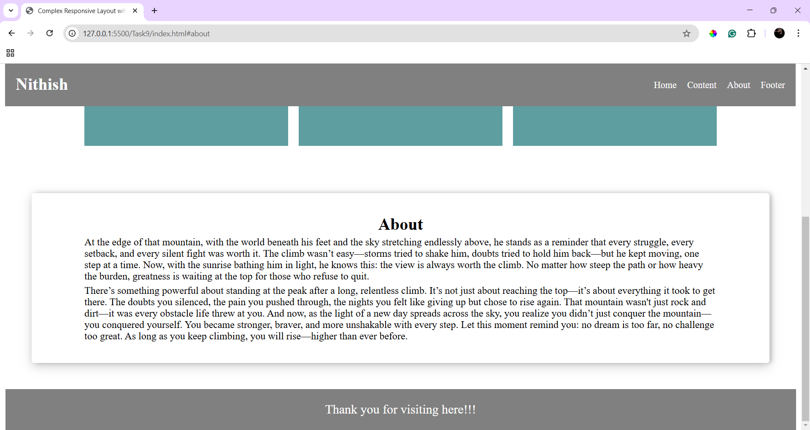
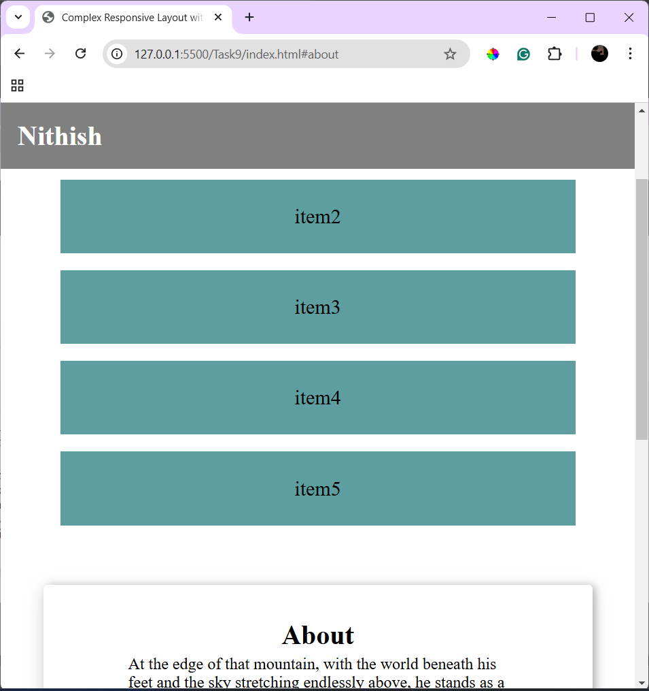

# Complex Responsive Layout with Grid and Flexbox

## Description
Implemented layout with CSS grid and flexbox

## New things learned
- Used flexbox effectively.
- Learned how to arrange the items in the container using **grid**.

## Output

